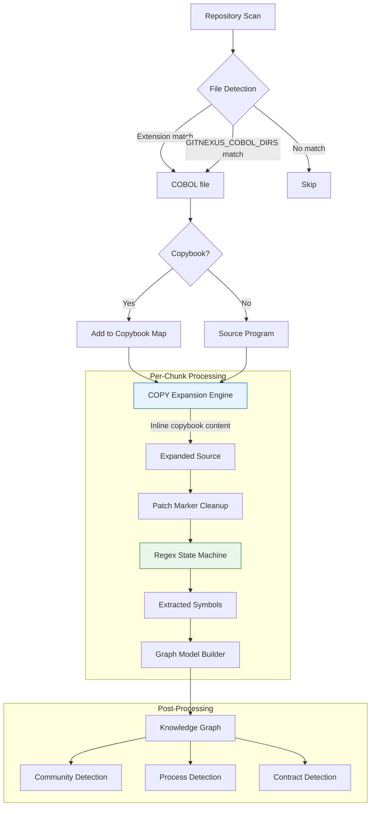

# COBOL Code Indexing

GitNexus indexes COBOL codebases using a **regex-only extraction** strategy, bypassing tree-sitter entirely. This document explains why, how the pipeline works, and links to detailed sub-documents.

## Why Regex-Only?

The tree-sitter-cobol grammar (v0.0.1) has three critical limitations that make it unusable for production indexing:

| Issue | Impact | Severity |
|-------|--------|----------|
| External scanner hangs on ~5% of files | No timeout mechanism exists for the C scanner; the process blocks indefinitely | **Blocking** |
| Only ~15% of paragraph headers detected | Most procedure-division paragraphs are invisible to the grammar | High |
| Patch markers in cols 1-6 cause parse errors | Enterprise COBOL uses non-standard sequence area content (e.g., `mzADD`, `estero`, `#FIX`) | High |

Because the external scanner hang cannot be interrupted (there is no `setTimeoutMicros` equivalent for tree-sitter), using tree-sitter-cobol would hang the indexing pipeline on a non-trivial fraction of real-world files.

The regex-only approach provides:

- **Speed**: ~1ms per file average extraction time
- **Reliability**: zero hangs, zero crashes across 13,000+ files
- **Coverage**: captures all critical symbols -- program name, paragraphs, sections, CALL, PERFORM, COPY, data items (01-77, 88-level), file declarations, FD entries, EXEC SQL/CICS blocks, ENTRY points, and MOVE statements

## Architecture

## COBOL vs Tree-Sitter Languages

| Feature | COBOL (Regex) | Tree-Sitter Languages |
|---------|--------------|----------------------|
| Parser | Single-pass regex state machine | tree-sitter grammar + queries |
| Speed | ~1ms/file | ~5ms/file |
| AST available | No | Yes |
| COPY expansion | Yes (pre-processing step) | N/A |
| Deep indexing | Data items, SQL, CICS, FD, ENTRY | Type annotations, generics, etc. |
| Call extraction | PERFORM (intra-file) + CALL (cross-program) | AST-based call site detection |
| Import extraction | COPY statements | `import`/`require`/`use`/`#include` |
| Coverage | All critical symbols | Language-dependent query coverage |
| Failure mode | Never hangs | External scanner can hang (COBOL only) |

## Sub-Documents

| Document | Description |
|----------|-------------|
| [File Detection](./file-detection.md) | Extension mapping, `GITNEXUS_COBOL_DIRS`, copybook classification |
| [COPY Expansion](./copy-expansion.md) | Copybook inlining, REPLACING transformations, cycle detection |
| [Regex Extraction](./regex-extraction.md) | State machine, regex patterns, line processing |
| [Deep Indexing](./deep-indexing.md) | Data items, EXEC SQL/CICS, file declarations, FD, ENTRY, MOVE |
| [Graph Model](./graph-model.md) | COBOL-specific node types, edge types, full annotated example |
| [Performance](./performance.md) | Benchmarks, worker pool tuning, caps, troubleshooting |

## Key Source Files

| File | Purpose |
|------|---------|
| `gitnexus/src/core/ingestion/cobol-preprocessor.ts` | Patch marker cleanup + regex extraction engine |
| `gitnexus/src/core/ingestion/cobol-copy-expander.ts` | COPY statement expansion with REPLACING |
| `gitnexus/src/core/ingestion/utils.ts` | `getLanguageFromPath`, `getLanguageFromFilename` |
| `gitnexus/src/core/ingestion/pipeline.ts` | `isCobolCopybook`, `expandCobolCopies`, `detectCrossProgamContracts` |
| `gitnexus/src/core/ingestion/workers/parse-worker.ts` | `processCobolRegexOnly` -- graph model builder |
| `gitnexus/src/core/ingestion/workers/worker-pool.ts` | Configurable sub-batch size for COBOL |
