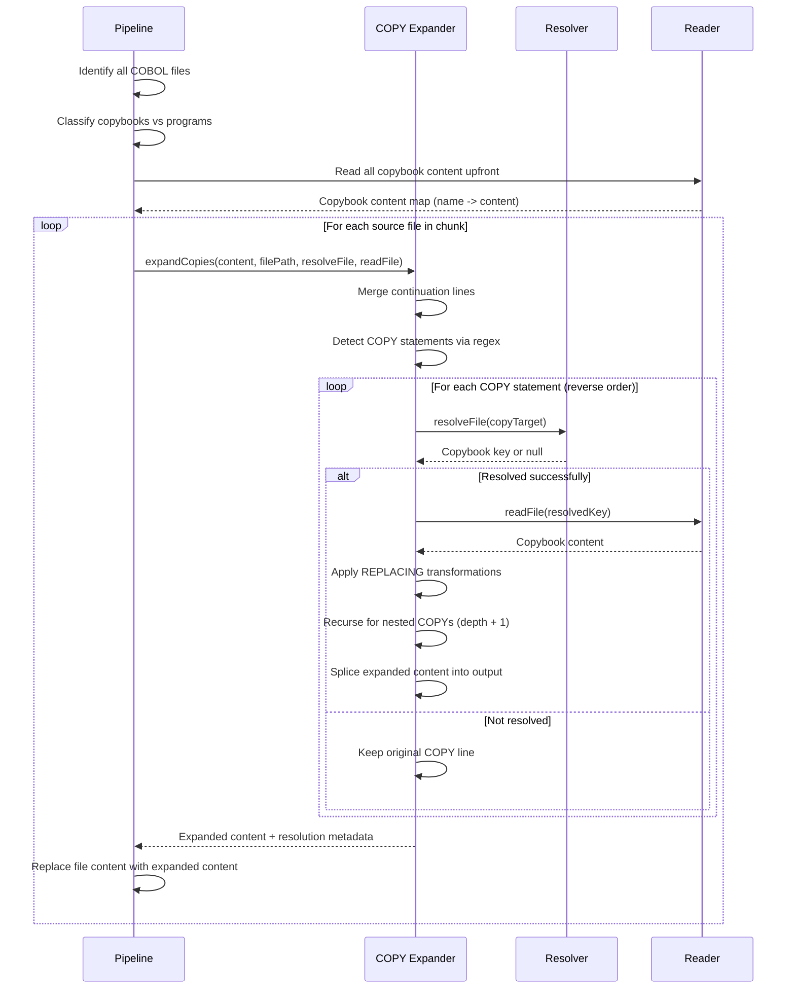

# COBOL COPY Expansion

The COPY statement is COBOL's include mechanism -- analogous to `#include` in C or `import` in modern languages. GitNexus expands COPY statements **before** regex extraction so that symbols defined inside copybooks (data items, paragraphs, etc.) are visible in the program's extracted graph.

## Supported Syntax

### Basic COPY

```cobol
COPY CPSESP.
COPY "WORKGRID.CPY".
```

Inlines the content of the named copybook, replacing the COPY line(s).

### COPY with REPLACING

```cobol
COPY CPSESP REPLACING "ANAZI-KEY" BY "LK-KEY".
COPY CPSESP REPLACING LEADING "ESP-" BY "LK-ESP-"
                       LEADING "KPSESPL" BY "LK-KPSESPL".
COPY LINKAGE REPLACING TRAILING "-IN" BY "-OUT".
```

Three REPLACING types are supported:

| Type         | Syntax                               | Behavior                                | Example                          |
| ------------ | ------------------------------------ | --------------------------------------- | -------------------------------- |
| **EXACT**    | `REPLACING "OLD" BY "NEW"`           | Replace exact identifier matches        | `ANAZI-KEY` becomes `LK-KEY`     |
| **LEADING**  | `REPLACING LEADING "PFX-" BY "NEW-"` | Replace prefix on all COBOL identifiers | `ESP-NAME` becomes `LK-ESP-NAME` |
| **TRAILING** | `REPLACING TRAILING "-IN" BY "-OUT"` | Replace suffix on all COBOL identifiers | `DATA-IN` becomes `DATA-OUT`     |

Multiple REPLACING clauses can appear in a single COPY statement. They are applied in order to each COBOL identifier in the copybook content.

### Multi-Line COPY

COPY statements can span multiple lines (standard COBOL continuation rules apply):

```cobol
       COPY CPSESP REPLACING
      -    LEADING "ESP-" BY "LK-ESP-"
      -    LEADING "KPSESPL" BY "LK-KPSESPL".
```

Continuation lines (indicator `-` in column 7) are merged before COPY statement scanning.

## Expansion Flow



The return type `CopyExpansionResult` contains `expandedContent` and `copyResolutions`. The `expansionDepth` field has been removed from the return type (it was unused by callers).

COPY statement line numbers in `CopyResolution` are 1-based (consistent with the preprocessor's line numbering). The splice operation that replaces COPY lines with expanded content adjusts for 0-based array indexing internally.

## Cycle Detection

Circular COPY references (e.g., copybook A includes copybook B which includes copybook A) are detected and handled:

1. Each expansion chain maintains a `visited` set of resolved copybook paths
2. If a copybook path is already in the visited set, the expansion is skipped
3. A `warnedCircular` set (internal to `expandCopies()`, not a parameter) deduplicates warning messages within a single file expansion

Known circular copybooks in PROJECT-NAME: `ANAZI`, `ANDIP`, `QDIPE` (self-referential includes).

## Max Depth

Nested COPY expansion is limited to **10 levels** (`DEFAULT_MAX_DEPTH`). If a COPY chain exceeds this depth, a warning is logged and the remaining COPY statements are left unexpanded.

## Max Total Expansions

A breadth amplification guard caps the total number of COPY expansions across all branches within a single file to **500** (`MAX_TOTAL_EXPANSIONS`). This prevents exponential blowup from diamond-shaped COPY graphs where N copybooks each include N other copybooks. Once the limit is reached, further COPY statements in that file are left unexpanded and a single warning is logged.

## REPLACING Application Detail

The REPLACING engine works by scanning all COBOL identifiers (matching `\b[A-Z][A-Z0-9-]*\b`) in the copybook content and applying each replacement rule:

```
Original copybook content:
       05  ESP-NAME          PIC X(30).
       05  ESP-CODE          PIC X(10).
       05  KPSESPL-FLAG      PIC X(01).

After REPLACING LEADING "ESP-" BY "LK-ESP-" LEADING "KPSESPL" BY "LK-KPSESPL":
       05  LK-ESP-NAME       PIC X(30).
       05  LK-ESP-CODE       PIC X(10).
       05  LK-KPSESPL-FLAG   PIC X(01).
```

For LEADING replacements, the engine checks if each identifier starts with the `from` prefix (case-insensitive) and replaces only the prefix portion, preserving the rest of the identifier.

For TRAILING replacements, the same logic applies to suffixes.

For EXACT replacements, only identifiers that match the `from` value exactly (case-insensitive) are replaced.

## Copybook Resolution

The resolver tries multiple strategies to match a COPY target name to a copybook file:

1. **Exact match**: `COPY CPSESP` resolves to copybook named `CPSESP`
2. **Strip extension**: `COPY WORKGRID.CPY` strips `.CPY` and resolves to `WORKGRID`
3. **Add extension**: `COPY CPSESP` tries `CPSESP.CPY` and `CPSESP.COPY`

If no match is found, the COPY statement is left in place (unexpanded) and a resolution record with `resolvedPath: null` is created.

## Pipeline Integration

The expansion runs **per chunk**, after file content is read but before dispatch to worker threads:

1. All copybook files are read upfront (they are typically small, collectively under 100MB)
2. Per chunk, the copybook map is merged with chunk content (in case a chunk contains copybooks)
3. Only programs (not copybooks themselves) undergo expansion
4. The expanded content replaces the original content in-place before worker dispatch

## Inline Comment Handling

The copy expander's `stripInlineComment()` helper is quote-aware: pipe characters (`|`) inside single- or double-quoted strings are preserved. This matches the same quote-aware logic used by the preprocessor.

## Source Files

- `gitnexus/src/core/ingestion/cobol-copy-expander.ts` -- `expandCopies()`, `parseReplacingClause()`, `applyReplacing()`
- `gitnexus/src/core/ingestion/pipeline.ts` -- `expandCobolCopies()`, copybook map construction, chunk integration
