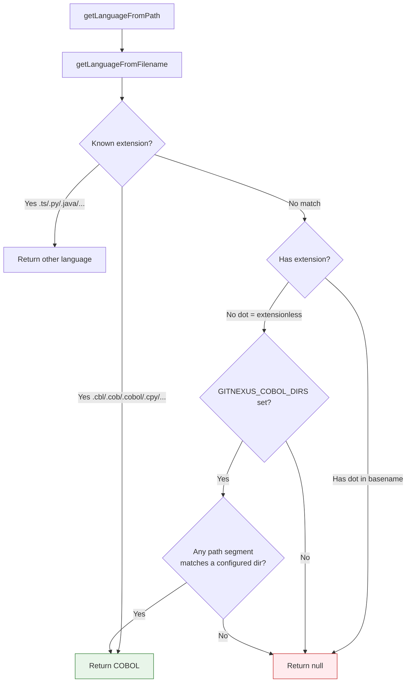

# COBOL File Detection

GitNexus detects COBOL files through two mechanisms: extension-based mapping and directory-based override for extensionless files. This document covers both, plus the copybook/program classification logic.

## Extension Mapping

### Program Extensions

| Extension | Type |
|-----------|------|
| `.cbl` | COBOL program |
| `.cob` | COBOL program |
| `.cobol` | COBOL program |

### Copybook Extensions

| Extension | Type | Notes |
|-----------|------|-------|
| `.cpy` | Copybook | Standard |
| `.copy` | Copybook | Standard |
| `.gnm` / `.GNM` | Copybook | Enterprise (GnuCOBOL naming) |
| `.fd` / `.FD` | Copybook | File Description fragment |
| `.wrk` / `.WRK` | Copybook | Working-Storage fragment |
| `.sel` / `.SEL` | Copybook | SELECT clause fragment |
| `.open` / `.OPEN` | Copybook | File OPEN fragment |
| `.close` / `.CLOSE` | Copybook | File CLOSE fragment |
| `.ini` / `.INI` | Copybook | Initialization fragment |
| `.def` / `.DEF` | Copybook | Definition fragment |

All extension matching is case-sensitive in `getLanguageFromFilename` (the extensions above are matched as written, including uppercase variants like `.GNM`).

## Extensionless File Detection: `GITNEXUS_COBOL_DIRS`

Many enterprise COBOL repositories use extensionless files -- the filename alone identifies the program (e.g., `s/BGTABFL` is the source for program `BGTABFL`). GitNexus handles this via the `GITNEXUS_COBOL_DIRS` environment variable.

### Configuration

Set `GITNEXUS_COBOL_DIRS` to a comma-separated list of directory names:

```bash
# Files in s/, c/, and wfproc/ directories (at any depth) are treated as COBOL
export GITNEXUS_COBOL_DIRS=s,c,wfproc
```

The matching is **case-insensitive** and checks all path segments:

- `/repo/s/BGTABFL` -- matches segment `s` -- COBOL
- `/repo/src/c/CPSESP` -- matches segment `c` -- COBOL
- `/repo/wfproc/WF001` -- matches segment `wfproc` -- COBOL
- `/repo/docs/README` -- no matching segment -- skipped

### Decision Tree



### Implementation Detail

The `GITNEXUS_COBOL_DIRS` value is parsed once (on first call) and cached in a `Set<string>`:

```typescript
// From gitnexus/src/core/ingestion/utils.ts
const getCobolDirs = (): Set<string> => {
  if (_cobolDirs) return _cobolDirs;
  const raw = process.env.GITNEXUS_COBOL_DIRS;
  _cobolDirs = raw
    ? new Set(raw.split(',').map(d => d.trim().toLowerCase()))
    : new Set();
  return _cobolDirs;
};
```

The path segment check splits the full path on `/` and tests each segment against the cached set.

## Copybook vs Program Classification

After a file is identified as COBOL, it must be classified as either a **program** (to be parsed for symbols) or a **copybook** (to be loaded into the copybook map for COPY expansion).

### Classification Rules

A COBOL file is classified as a **copybook** if ANY of these conditions is true:

1. It has a recognized copybook extension (`.cpy`, `.copy`, `.gnm`, `.fd`, `.wrk`, `.sel`, `.open`, `.close`, `.ini`, `.def`)
2. It is an extensionless file whose path contains a directory segment matching one of: `c`, `copy`, `copybooks`, `copylib`, `cpy`

A file is classified as a **program** if:

1. It has a program extension (`.cbl`, `.cob`, `.cobol`), OR
2. It is extensionless and does NOT match any copybook directory pattern

### Copybook Name Resolution

Copybook names are derived from the filename:

- Strip the extension (if any)
- Convert to uppercase

Examples:
- `c/CPSESP` -- name: `CPSESP`
- `copy/workgrid.cpy` -- name: `WORKGRID`
- `c/ANAZI.GNM` -- name: `ANAZI`

This name is used to resolve `COPY CPSESP.` statements during expansion.

## Source Files

- `gitnexus/src/core/ingestion/utils.ts` -- `getLanguageFromPath()`, `getLanguageFromFilename()`, `getCobolDirs()`
- `gitnexus/src/core/ingestion/pipeline.ts` -- `isCobolCopybook()`, `getCopybookName()`, `COPYBOOK_EXTENSIONS`, `COBOL_PROGRAM_EXTENSIONS`
