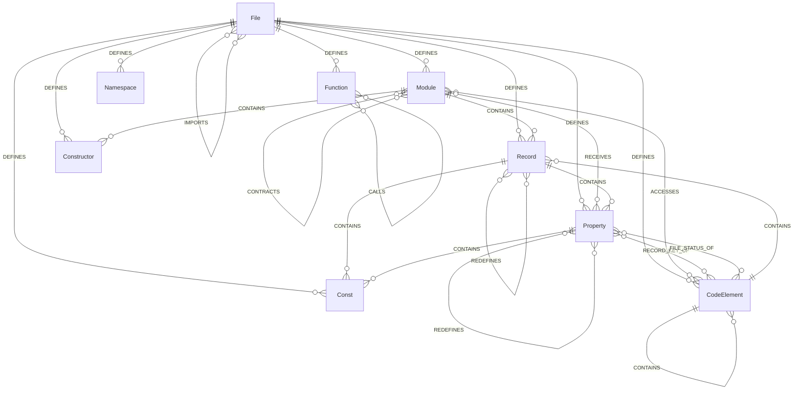

# COBOL Graph Model

This document describes the graph nodes and edges that GitNexus creates for COBOL codebases. The COBOL graph model is richer than most tree-sitter languages because it captures domain-specific constructs: file declarations, FD entries, data hierarchies, SQL tables, CICS maps, and cross-program contracts.

## Entity-Relationship Diagram



## Node Types

| Node Type | COBOL Concept | Created From | Example |
|-----------|--------------|--------------|---------|
| `Module` | PROGRAM-ID | `PROGRAM-ID. BGTABFL` | Name: `BGTABFL`, description may include author and date |
| `Function` | Paragraph | `PROCESS-RECORD.` at column 8 | Name: `PROCESS-RECORD` |
| `Namespace` | Procedure section | `MAIN-LOGIC SECTION.` at column 8 | Name: `MAIN-LOGIC` |
| `Record` | 01-level data item | `01 WK-EMPLOYEE.` | Description: `level:01 section:working-storage` |
| `Property` | 02-49/66/77 data item | `05 WK-NAME PIC X(30).` | Description: `level:05 pic:X(30) section:working-storage` |
| `Const` | 88-level condition | `88 WK-ACTIVE VALUE "A".` | Description: `level:88 values:A` |
| `CodeElement` | SELECT, FD, SQL table, CICS map, cursor, transid | Various | Description varies by subtype |
| `Constructor` | ENTRY point | `ENTRY "SUBPROG" USING WK-DATA` | Description: `entry params:WK-DATA` |

### CodeElement Subtypes

CodeElement is used for multiple COBOL constructs, distinguished by their description prefix:

| Subtype | ID Pattern | Description Format | Example |
|---------|-----------|-------------------|---------|
| File SELECT | `CodeElement:{path}:SELECT:{name}` | `select org:INDEXED access:DYNAMIC ...` | `SELECT MASTER-FILE` |
| FD entry | `CodeElement:{path}:FD:{name}` | `fd record:{recordName}` | `FD MASTER-FILE` |
| SQL table | `CodeElement:{path}:sql-table:{name}` | `sql-table op:SELECT` | Table `EMPLOYEES` |
| SQL cursor | `CodeElement:{path}:sql-cursor:{name}` | `sql-cursor` | Cursor `C-EMPLOYEES` |
| CICS map | `CodeElement:{path}:cics-map:{name}` | `cics-map cmd:SEND MAP` | Map `EMPMENU` |
| CICS transid | `CodeElement:{path}:cics-transid:{name}` | `cics-transid cmd:START` | Transid `EMP1` |

## Edge Types

| Edge Type | Source | Target | Created By | Confidence | Example |
|-----------|--------|--------|-----------|------------|---------|
| `DEFINES` | File | any node | File defines its symbols | 1.0 | File -> Module `BGTABFL` |
| `CALLS` | Function | Function | `PERFORM X [THRU Y]` | (via call-processor) | `PROCESS-RECORD` -> `CALC-TAX` |
| `CALLS` | Module | Module | `CALL "BGTABUP"` | (via call-processor) | `BGTABFL` -> `BGTABUP` |
| `CALLS` | Module | Module | `EXEC CICS LINK PROGRAM('X')` | (via call-processor) | `BGTABFL` -> `BGTABUP` |
| `IMPORTS` | File | File | `COPY copybook` | (via import-processor) | Source file -> Copybook file |
| `CONTAINS` | Module | Record | Data hierarchy root | 1.0 | `BGTABFL` -> `WK-EMPLOYEE` |
| `CONTAINS` | Record | Property | Data hierarchy | 1.0 | `WK-EMPLOYEE` -> `WK-NAME` |
| `CONTAINS` | Property | Property | Nested data items | 1.0 | `WK-ADDRESS` -> `WK-CITY` |
| `CONTAINS` | Record/Property | Const | 88-level parent | 1.0 | `WK-STATUS` -> `WK-ACTIVE` |
| `CONTAINS` | CodeElement (FD) | Record | FD record link | 1.0 | `FD:MASTER-FILE` -> `MASTER-RECORD` |
| `CONTAINS` | CodeElement (SELECT) | CodeElement (FD) | SELECT-FD link | 0.9 | `SELECT:MASTER-FILE` -> `FD:MASTER-FILE` |
| `CONTAINS` | Module | Constructor | ENTRY in module | 1.0 | `BGTABFL` -> `SUBPROG` |
| `REDEFINES` | Record | Record | `01 X REDEFINES Y` | 1.0 | `WK-DATE-NUM` -> `WK-DATE-ALPHA` |
| `REDEFINES` | Property | Property | `05 X REDEFINES Y` | 1.0 | `WK-CODE-NUM` -> `WK-CODE-ALPHA` |
| `RECORD_KEY_OF` | Property | CodeElement (SELECT) | `RECORD KEY IS field` | 0.8 | `WK-EMP-ID` -> `SELECT:MASTER-FILE` |
| `FILE_STATUS_OF` | Property | CodeElement (SELECT) | `FILE STATUS IS field` | 0.8 | `WK-FS` -> `SELECT:MASTER-FILE` |
| `ACCESSES` | Module | CodeElement | EXEC SQL/CICS | 0.9 | `BGTABFL` -> `sql-table:EMPLOYEES` |
| `RECEIVES` | Module | Property | `PROCEDURE USING` | 0.8 | `BGTABFL` -> `WK-INPUT-REC` |
| `CONTRACTS` | Module | Module | Shared copybook detection | 0.9 | `BGTABFL` -> `BGTABUP` (via `CPSESP`) |

## Full Annotated Example

Given this COBOL program:

```cobol
       IDENTIFICATION DIVISION.
       PROGRAM-ID. EMPMAINT.
       AUTHOR. Development Team.

       ENVIRONMENT DIVISION.
       INPUT-OUTPUT SECTION.
       FILE-CONTROL.
           SELECT EMP-FILE
               ASSIGN TO "EMPLOYEE.DAT"
               ORGANIZATION IS INDEXED
               ACCESS MODE IS DYNAMIC
               RECORD KEY IS EMP-ID
               FILE STATUS IS WS-FILE-STATUS.

       DATA DIVISION.
       FILE SECTION.
       FD  EMP-FILE.
       01  EMP-RECORD.
           05  EMP-ID             PIC 9(6).
           05  EMP-NAME           PIC X(30).

       WORKING-STORAGE SECTION.
       01  WS-FLAGS.
           05  WS-FILE-STATUS     PIC X(02).
           05  WS-EOF-FLAG        PIC X(01).
               88  WS-EOF         VALUE "Y".

       LINKAGE SECTION.
       01  LK-SEARCH-KEY          PIC 9(6).

       PROCEDURE DIVISION USING LK-SEARCH-KEY.
       MAIN-LOGIC SECTION.
       MAIN-START.
           PERFORM OPEN-FILE
           PERFORM PROCESS-RECORDS
           PERFORM CLOSE-FILE
           STOP RUN.

       OPEN-FILE.
           OPEN I-O EMP-FILE.

       PROCESS-RECORDS.
           MOVE LK-SEARCH-KEY TO EMP-ID
           EXEC SQL
               SELECT EMP_SALARY INTO :WS-SALARY
               FROM EMPLOYEES
               WHERE EMP_ID = :EMP-ID
           END-EXEC
           CALL "EMPREPORT".

       CLOSE-FILE.
           CLOSE EMP-FILE.
```

The graph produced contains:

**Nodes:**
- `Module`: EMPMAINT (description: `author:Development Team`)
- `Namespace`: MAIN-LOGIC
- `Function`: MAIN-START, OPEN-FILE, PROCESS-RECORDS, CLOSE-FILE
- `Record`: EMP-RECORD, WS-FLAGS, LK-SEARCH-KEY
- `Property`: EMP-ID, EMP-NAME, WS-FILE-STATUS, WS-EOF-FLAG
- `Const`: WS-EOF (values: Y)
- `CodeElement`: SELECT:EMP-FILE, FD:EMP-FILE, sql-table:EMPLOYEES
- (COPY imports, if any, would produce File IMPORTS edges)

**Edges:**
- `DEFINES`: File -> all nodes
- `CONTAINS`: EMPMAINT -> EMP-RECORD, EMPMAINT -> WS-FLAGS, EMPMAINT -> LK-SEARCH-KEY
- `CONTAINS`: EMP-RECORD -> EMP-ID, EMP-RECORD -> EMP-NAME
- `CONTAINS`: WS-FLAGS -> WS-FILE-STATUS, WS-FLAGS -> WS-EOF-FLAG
- `CONTAINS`: WS-EOF-FLAG -> WS-EOF
- `CONTAINS`: FD:EMP-FILE -> EMP-RECORD
- `CONTAINS`: SELECT:EMP-FILE -> FD:EMP-FILE
- `CALLS`: MAIN-START -> OPEN-FILE, MAIN-START -> PROCESS-RECORDS, MAIN-START -> CLOSE-FILE
- `CALLS`: EMPMAINT -> EMPREPORT (external CALL)
- `ACCESSES`: EMPMAINT -> sql-table:EMPLOYEES
- `RECEIVES`: EMPMAINT -> LK-SEARCH-KEY (PROCEDURE USING)
- `RECORD_KEY_OF`: EMP-ID -> SELECT:EMP-FILE
- `FILE_STATUS_OF`: WS-FILE-STATUS -> SELECT:EMP-FILE

## How COBOL Differs from Tree-Sitter Languages

| Aspect | COBOL | Tree-Sitter Languages |
|--------|-------|----------------------|
| Node variety | 8 types (Module, Function, Namespace, Record, Property, Const, CodeElement, Constructor) | Typically 4-6 (Function, Class, Method, Interface, Module, Const) |
| Domain edges | RECORD_KEY_OF, FILE_STATUS_OF, ACCESSES, RECEIVES, CONTRACTS, REDEFINES | Primarily CALLS, IMPORTS, EXTENDS, IMPLEMENTS |
| Data hierarchy | Deep CONTAINS chains (01 -> 05 -> 10 -> 88) | Flat class members |
| Cross-program calls | CALL "name" + CICS LINK PROGRAM | Import-based resolution |
| Contract detection | Shared COPY copybook between caller/callee | Not applicable |
| Metadata | AUTHOR, DATE-WRITTEN on Module | JSDoc/docstring (not indexed) |

## Source Files

- `gitnexus/src/core/ingestion/workers/parse-worker.ts` -- `processCobolRegexOnly()`, node/edge emission logic
- `gitnexus/src/core/ingestion/pipeline.ts` -- `detectCrossProgamContracts()` for CONTRACTS edges
- `gitnexus/src/core/ingestion/cobol-preprocessor.ts` -- `CobolRegexResults` interface (all extracted data)
