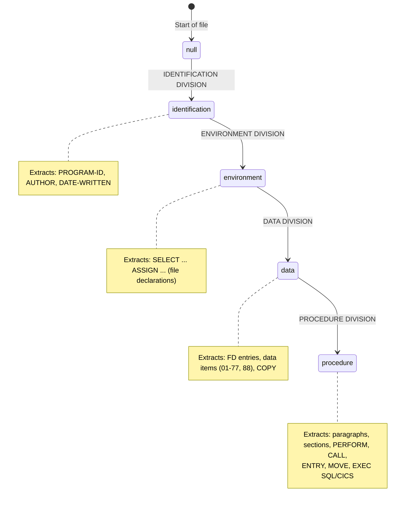
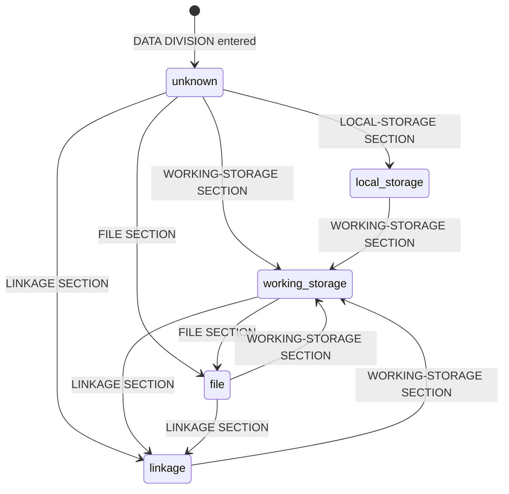

# COBOL Regex Extraction

The `extractCobolSymbolsWithRegex()` function in `cobol-preprocessor.ts` performs single-pass, state-machine-driven extraction of all COBOL symbols. This document describes the state machine, line processing flow, and every regex pattern used.

## State Machine: Division Tracking

The extractor tracks which COBOL division is currently being processed. Division transitions are detected by the `RE_DIVISION` pattern.



## State Machine: Data Section Tracking

Within the DATA DIVISION, a secondary state machine tracks the current section to tag data items with their origin.



Within the ENVIRONMENT DIVISION, the `currentEnvSection` tracks whether we are in `INPUT-OUTPUT` or `CONFIGURATION` section. SELECT statement accumulation only occurs in `INPUT-OUTPUT`.

## Line Processing Flow

Each raw source line goes through this pipeline:

```
Raw line
  |
  v
Length < 7? ---------> Skip (flush pending if any)
  |
  v
Indicator col 7
  |
  +-- '*' or '/' -----> Comment: skip entirely
  |
  +-- '-' ------------> Continuation: append to pending line
  |
  +-- other ----------> Normal: flush pending, strip inline comments (|),
                        buffer as new pending logical line
```

After all lines are processed, the final pending line is flushed, along with any accumulated SELECT statement, SORT/MERGE accumulator, and any open EXEC block (truncated file without `END-EXEC`).

### Inline Comment Stripping

Enterprise COBOL (particularly Italian dialect) uses the pipe character `|` as an inline comment marker. The `stripInlineComment()` helper is **quote-aware**: it tracks whether the scan position is inside a single- or double-quoted string and only treats `|` as a comment marker when outside quotes. Pipe characters inside string literals are preserved.

Free-format `*>` inline comment stripping uses the same quote-aware approach: the scanner walks character by character, toggling quote state, and only recognizes `*>` as a comment marker when not inside a quoted string.

### Patch Marker Handling

The `preprocessCobolSource()` function (run before extraction in the worker) replaces non-standard content in columns 1-6. Standard COBOL expects spaces or digit sequence numbers in this area. If any letter or `#` character is found, the entire sequence area is replaced with 6 spaces:

```
Before: mzADD MOVE WK-AMT TO WK-TOTAL
After:        MOVE WK-AMT TO WK-TOTAL
```

This preserves exact line count for position mapping.

## Regex Pattern Reference

All patterns are compiled once as module-level constants and reused across calls.

### Division and Section Detection

| Constant | Pattern | Purpose | Example Match |
|----------|---------|---------|---------------|
| `RE_DIVISION` | `\b(IDENTIFICATION\|ENVIRONMENT\|DATA\|PROCEDURE)\s+DIVISION\b` | Division boundary | `PROCEDURE DIVISION` |
| `RE_SECTION` | `\b(WORKING-STORAGE\|LINKAGE\|FILE\|LOCAL-STORAGE\|INPUT-OUTPUT\|CONFIGURATION)\s+SECTION\b` | Section boundary | `WORKING-STORAGE SECTION` |

### IDENTIFICATION DIVISION

| Constant | Pattern | Purpose | Example Match |
|----------|---------|---------|---------------|
| `RE_PROGRAM_ID` | `\bPROGRAM-ID\.\s*([A-Z][A-Z0-9-]*)` | Program name | `PROGRAM-ID. BGTABFL` |
| `RE_AUTHOR` | `^\s+AUTHOR\.\s*(.+)` | Author metadata | `AUTHOR. D. Smith` |
| `RE_DATE_WRITTEN` | `^\s+DATE-WRITTEN\.\s*(.+)` | Date metadata | `DATE-WRITTEN. 2024-01-15` |

### ENVIRONMENT DIVISION

| Constant | Pattern | Purpose | Example Match |
|----------|---------|---------|---------------|
| `RE_SELECT_START` | `\bSELECT\s+(?:OPTIONAL\s+)?([A-Z][A-Z0-9-]+)` | File SELECT start (with optional `SELECT OPTIONAL` support) | `SELECT MASTER-FILE`, `SELECT OPTIONAL TRANS-FILE` |

SELECT statements are accumulated across multiple lines until a period terminator is found, then parsed for ASSIGN, ORGANIZATION, ACCESS, RECORD KEY, and FILE STATUS clauses.

### DATA DIVISION

| Constant | Pattern | Purpose | Example Match |
|----------|---------|---------|---------------|
| `RE_FD` | `^\s+FD\s+([A-Z][A-Z0-9-]+)` | File description | `FD MASTER-FILE` |
| `RE_DATA_ITEM` | `^\s+(\d{1,2})\s+([A-Z][A-Z0-9-]+)\s*(.*)` | Data item (01-77) | `05 WK-NAME PIC X(30)` |
| `RE_ANONYMOUS_REDEFINES` | `^\s+(\d{1,2})\s+REDEFINES\s+([A-Z][A-Z0-9-]+)` | Anonymous REDEFINES | `01 REDEFINES WK-REC` |
| `RE_88_LEVEL` | `^\s+88\s+([A-Z][A-Z0-9-]+)\s+VALUES?\s+(?:ARE\s+)?(.+)` | Condition name | `88 WK-ACTIVE VALUE "Y"` |

The trailing clauses of `RE_DATA_ITEM` are parsed by `parseDataItemClauses()` for PIC, USAGE, OCCURS, and REDEFINES.

### PROCEDURE DIVISION

| Constant | Pattern | Purpose | Example Match |
|----------|---------|---------|---------------|
| `RE_PROC_SECTION` | `^       ([A-Z][A-Z0-9-]+)\s+SECTION\.\s*$` | Procedure section header | `       MAIN-LOGIC SECTION.` |
| `RE_PROC_PARAGRAPH` | `^       ([A-Z][A-Z0-9-]+)\.\s*$` | Paragraph header | `       PROCESS-RECORD.` |
| `RE_PERFORM` | `\bPERFORM\s+([A-Z][A-Z0-9-]+)(?:\s+THRU\s+([A-Z][A-Z0-9-]+))?` | PERFORM call | `PERFORM CALC-TAX THRU CALC-TAX-EXIT` |
| `RE_PROC_USING` | `\bPROCEDURE\s+DIVISION\s+USING\s+([\s\S]*?)(?:\.\|$)` | USING parameters | `PROCEDURE DIVISION USING WK-PARAM` |
| `RE_ENTRY` | `\bENTRY\s+"([^"]+)"(?:\s+USING\s+([\s\S]*?))?(?:\.\|$)` | ENTRY point | `ENTRY "SUBPROG" USING WK-DATA` |
| `RE_MOVE` | `\bMOVE\s+((?:CORRESPONDING\|CORR)\s+)?([A-Z][A-Z0-9-]+)\s+TO\s+(.+)` | MOVE statement (supports CORR abbreviation and multi-target) | `MOVE WK-NAME TO OUT-NAME`, `MOVE CORR WK-IN TO WK-OUT` |

The USING parameter list (`RE_PROC_USING`) is split on `\bRETURNING\b` before tokenization -- any RETURNING clause and everything after it is excluded from the parameter list (`.split(/\bRETURNING\b/i)[0]`).

Note: `RE_PROC_SECTION` and `RE_PROC_PARAGRAPH` require exactly 7 spaces of leading indentation (COBOL area A starting at column 8). This is the standard COBOL paragraph indentation.

### All-Division Patterns

These patterns are checked regardless of current division:

| Constant | Pattern | Purpose | Example Match |
|----------|---------|---------|---------------|
| `RE_CALL` | `\bCALL\s+"([^"]+)"` | External program call | `CALL "BGTABUP"` |
| `RE_COPY_UNQUOTED` | `\bCOPY\s+([A-Z][A-Z0-9-]+)(?:\s\|\.)` | COPY (unquoted) | `COPY CPSESP.` |
| `RE_COPY_QUOTED` | `\bCOPY\s+"([^"]+)"(?:\s\|\.)` | COPY (quoted) | `COPY "WORKGRID.CPY".` |

### SORT/MERGE Support

| Constant | Purpose |
|----------|---------|
| `SORT_CLAUSE_NOISE` | Set of SORT/MERGE clause keywords filtered from USING/GIVING file lists: `ON`, `ASCENDING`, `DESCENDING`, `KEY`, `WITH`, `DUPLICATES`, `IN`, `ORDER`, `COLLATING`, `SEQUENCE`, `IS`, `THROUGH`, `THRU`, `INPUT`, `OUTPUT`, `PROCEDURE` |

SORT and MERGE statements are accumulated across multiple lines (like SELECT) until a period terminator is found, then parsed for USING/GIVING file lists and INPUT/OUTPUT PROCEDURE targets. The `flushSort()` helper encapsulates the flush-and-parse logic, mirroring the existing `flushSelect()` pattern. Both helpers are called at EOF to handle truncated files.

### GO TO Multi-Target

`RE_GOTO` captures all paragraph names in a `GO TO` statement, including the multi-target form `GO TO p1 p2 p3 DEPENDING ON x`. The captured group contains all target names (space-separated), which are split into individual targets. Each target produces a separate `gotos` entry.

### PROGRAM-ID Detection

PROGRAM-ID is detected regardless of the current division state. This handles sibling programs that appear after `END PROGRAM` and omit the `IDENTIFICATION DIVISION` header -- the extractor will still capture the PROGRAM-ID and push a new program boundary.

### EXEC Block Patterns

| Constant | Pattern | Purpose | Example Match |
|----------|---------|---------|---------------|
| `RE_EXEC_SQL_START` | `\bEXEC\s+SQL\b` | Start of EXEC SQL block | `EXEC SQL` |
| `RE_EXEC_CICS_START` | `\bEXEC\s+CICS\b` | Start of EXEC CICS block | `EXEC CICS` |
| `RE_END_EXEC` | `\bEND-EXEC\b` | End of EXEC block | `END-EXEC` |

EXEC blocks accumulate all lines between `EXEC SQL/CICS` and `END-EXEC`, then delegate to `parseExecSqlBlock()` or `parseExecCicsBlock()` for detailed extraction.

## Excluded Paragraph Names

The following names are excluded from paragraph detection to avoid false positives from division/section headers:

```
DECLARATIVES, END, PROCEDURE, IDENTIFICATION,
ENVIRONMENT, DATA, WORKING-STORAGE, LINKAGE,
FILE, LOCAL-STORAGE, COMMUNICATION, REPORT,
SCREEN, INPUT-OUTPUT, CONFIGURATION
```

Additionally, paragraph candidates containing `DIVISION` or `SECTION` as substrings are excluded.

## MOVE Skip List (Figurative Constants)

MOVE statements where the source is a figurative constant are skipped:

```
SPACES, ZEROS, ZEROES, LOW-VALUES, LOW-VALUE,
HIGH-VALUES, HIGH-VALUE, QUOTES, QUOTE, ALL
```

## Source Files

- `gitnexus/src/core/ingestion/cobol-preprocessor.ts` -- `preprocessCobolSource()`, `extractCobolSymbolsWithRegex()`, all regex constants
